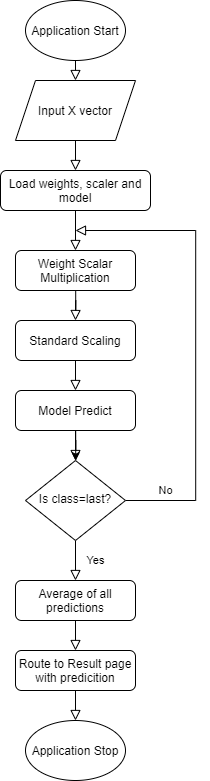

# Red Wine Quality Predictor

This application predicts the quality of red wine based on chemical composition details. 
Input variables (based on physicochemical tests):
1 - fixed acidity

2 - volatile acidity

3 - citric acid

4 - residual sugar

5 - chlorides

6 - free sulfur dioxide

7 - total sulfur dioxide

8 - density

9 - pH

10 - sulphates

11 - alcohol

Output variable (based on sensory data):
1 - quality (score between 3 and 8 inclusive)

## Application Link

Use the [link](https://red-wine-qlty-pred.herokuapp.com/winequality/) to run the web application on Browser.

## Methodology
### Dataset
The Dataset is selected from kaggle and can be seen in the ml_models folder as 'winequality-red.csv' . The data is one with high class imbalance. The dataset is biased towards class 5 and 6.

### Data and Feature Engineering
#### Handling Class Imbalance
The imbalance was handled by the following self devised technique :-
Multiply the reciprocal of value counts of the class to which the datapoint belongs to in the dataset.

Weight of class (W[c]) = 1/(frequency of class c).

X'[i] = W[c]*X[i] (for Y[i]==c).
where X[i] is a row vector of independent varaibles, Y[i] is the target dependent variable and W[c] is a scalar computed above.

This operation improved the model performance drastically which can be seen in the following model performances done with comparative study.

#### Scaling
The data was scaled using the Standard Scalar from Scikit learn library.

### Decomposition
PCA was applied but no such improvement was found in the model performance with PCA. Therefore not used.

### Model Training
Multiple Machine Learning Models were trained to predict the class of the wine being tested using the above mentioned features. Hyperparameter tuning was done to obtain optimum results by iterating over parameters.

| Model with Hyperparameters                                               | Score             | Score w Balancing |
| ------------------------------------------------------------------------ | ----------------- |------------------ |
| Logistic Regression (Unoptimized)                                        | (60.32%, 56.44%)  | (44.07%, 41.48%)  |
| Logistic Regression (C=1, multiclass='ovr',solver='newton-cg')           | (60.60%, 56.63%)  | (69.56%, 68.37%)  |
| Logistic Regression (C=36, multiclass='multinomial',solver='newton-cg')  | (62.46%, 57.20%)  | (92.43%, 92.04%)  |
| Support Vector Classifier (kernel='poly',C=100000)                       | (30.53%, 33.34%)  | (97.39%, 96.40%)  |
| Support Vector Classifier (kernel='linear',C=1)                          | (60.13%, 55.87%)  | (79.74%, 42.23%)  |

Therefore it was seen that balancing operation improved model performance. Hence further hyperparameter tuning was done with graphical study to obtain optimum parameters for Support Vector Classifier. 

Best fit model -> SVC(kernel='linear',C=100,decision_function_shape='ovo',gamma=0.01)
with score -> (99.72%, 99.81%)

### Application Deployment
The model is deployed using Django framework with templating for basic frontend. The Django application is deployed on Heroku.

Flowchart of application process :-

### Screenshots

## License
[MIT](https://choosealicense.com/licenses/mit/)