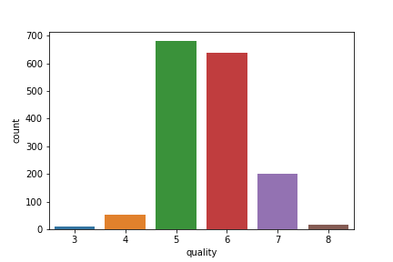

# Red Wine Quality Predictor

This application predicts the quality of red wine based on chemical composition details. 
Input variables (based on physicochemical tests):
1 - fixed acidity
2 - volatile acidity
3 - citric acid
4 - residual sugar
5 - chlorides
6 - free sulfur dioxide
7 - total sulfur dioxide
8 - density
9 - pH
10 - sulphates
11 - alcohol

Output variable (based on sensory data):
1 - quality (score between 0 and 10)

## Application Link

Use the link - https://red-wine-qlty-pred.herokuapp.com/winequality/) to run the web application on Browser.

## Methodology
### Dataset
The Dataset was selected from kaggle and can be seen in the ml_models folder as 'winequality-red.csv' . The data was one with high class imbalance.


### Handling Class Imbalance
The imbalance was handled by the following technique :-
Multiply the reciprocal of value counts of the class to which the datapoint belongs to in the dataset.

### Model Training
A Machine Learning Model was trained to 

```python
import foobar

# returns 'words'
foobar.pluralize('word')

# returns 'geese'
foobar.pluralize('goose')

# returns 'phenomenon'
foobar.singularize('phenomena')
```

## Contributing
Pull requests are welcome. For major changes, please open an issue first to discuss what you would like to change.

Please make sure to update tests as appropriate.

## License
[MIT](https://choosealicense.com/licenses/mit/)